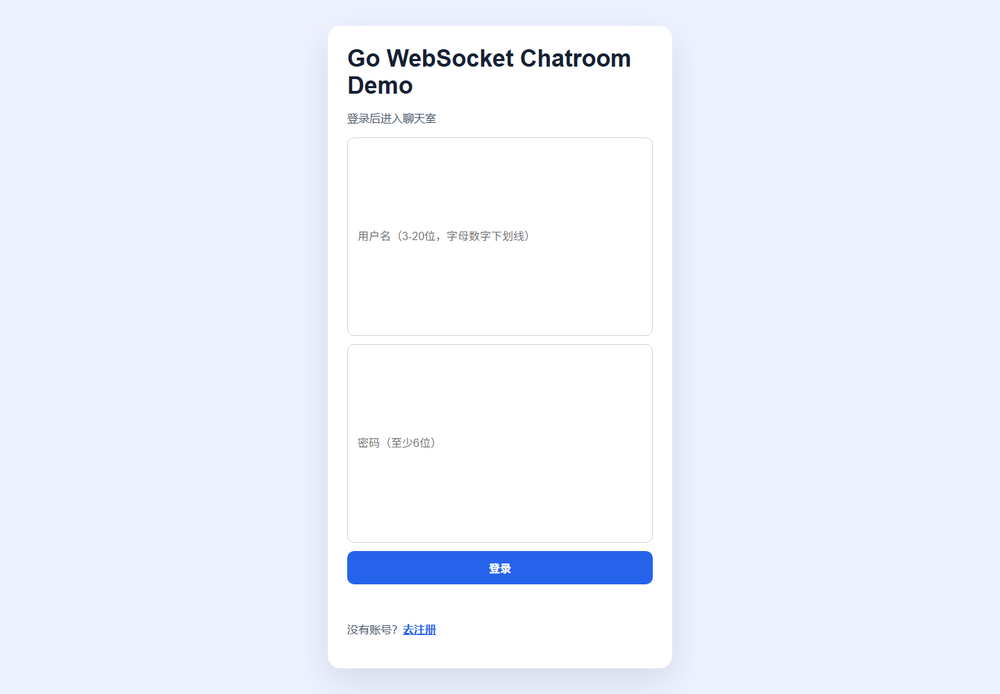
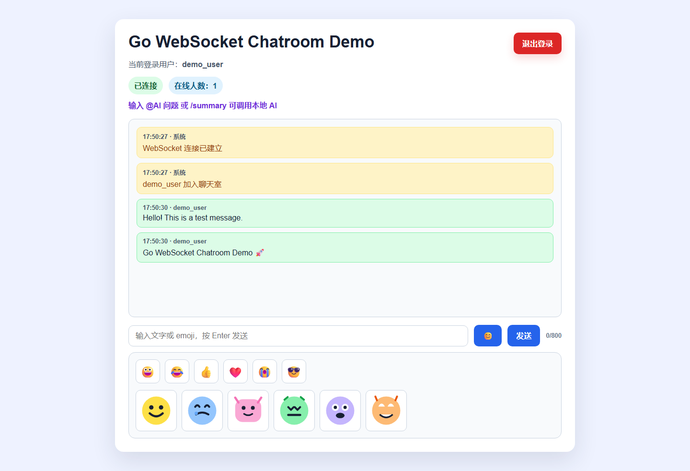
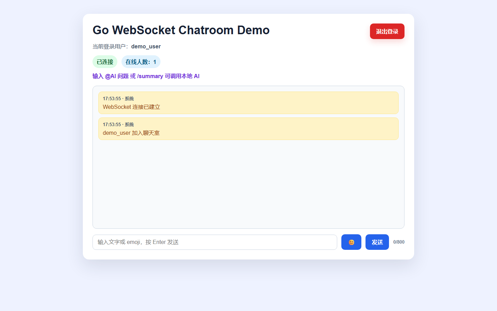

# Go WebSocket Chatroom Demo

[中文说明](README_CN.md)

A small real-time chatroom demo built with Go, Gorilla WebSocket, and plain HTML/CSS/JavaScript. It includes local user registration, session-based login, message history, emoji/stickers, and optional local Ollama AI assistant commands.

## Features

- Register, login, and logout
- Protected chatroom page and protected WebSocket endpoint
- Real-time multi-user chat over WebSocket
- Online user count
- System join/leave notifications
- Last 20 message history replay on reconnect
- Text, emoji, and local SVG sticker messages
- Distinct styles for self, other users, system messages, stickers, history, and AI messages
- Message length limit and character counter
- WebSocket connection status indicator (connected / disconnected / reconnecting)
- Auto reconnect with exponential backoff on disconnect
- Input validation for username and password on both frontend and backend
- Optional local Ollama AI assistant with `@AI`, `/ai`, and `/summary`

## Tech Stack

- Go
- net/http
- github.com/gorilla/websocket
- golang.org/x/crypto/bcrypt
- Plain HTML/CSS/JavaScript
- Optional Ollama local model API

## Directory Structure

```text
.
├── go.mod
├── go.sum
├── Dockerfile
├── docker-compose.yml
├── main.go
├── users.example.json
├── public/
│   ├── app.js
│   ├── index.html
│   ├── login.html
│   ├── register.html
│   ├── style.css
│   └── stickers/
│       ├── sticker-1.svg
│       ├── sticker-2.svg
│       ├── sticker-3.svg
│       ├── sticker-4.svg
│       ├── sticker-5.svg
│       └── sticker-6.svg
├── docs/
│   └── images/
│       ├── login.png
│       ├── chatroom.png
│       ├── reconnect.png
│       └── mobile.png
├── README.md
└── README_CN.md
```

## Screenshots

### Login Page



Clean login interface with input validation for username (3-20 characters, letters/digits/hyphens/underscores) and password (minimum 6 characters).

### Chatroom



Real-time multi-user chat with online user count, message history, emoji support, and local SVG stickers.

### WebSocket Reconnect



Automatic reconnection with exponential backoff when connection is lost. Shows connection status indicator (connected / disconnected / reconnecting).

## Getting Started

Install Go 1.21+, then run:

```powershell
go mod tidy
go run main.go
```

Open:

```text
http://localhost:8088
```

The app creates `users.json` automatically on first run. That file stores local demo users and is intentionally ignored by Git.

## Docker

Build and run with Docker Compose:

```powershell
docker compose up --build
```

Open:

```text
http://localhost:8088
```

The Compose file stores demo users in a named volume and sets optional Ollama environment variables. Ollama is not required; AI commands will show a friendly unavailable message if the Ollama service is not running.

To stop the containers:

```powershell
docker compose down
```

To rebuild after code changes:

```powershell
docker compose up --build
```

## Optional Ollama AI Assistant

Start Ollama separately, then set the API URL and model if needed:

```powershell
$env:OLLAMA_URL = "http://localhost:11434"
$env:OLLAMA_MODEL = "qwen2.5:3b"
go run main.go
```

In the chatroom:

```text
@AI Explain WebSocket in one sentence
/ai Summarize what Gorilla WebSocket does
/summary
```

If Ollama is not running, the chatroom remains available and returns a friendly AI unavailable message.

## Project Highlights

- **Zero external frontend dependencies**: Pure HTML/CSS/JavaScript, no build tools required
- **bcrypt password hashing**: Passwords are never stored in plaintext
- **HttpOnly + SameSite cookies**: Session tokens are not accessible via JavaScript
- **Message length limit**: 800 characters per message with real-time counter
- **Sticker URL whitelist**: Only pre-approved sticker URLs are accepted
- **Graceful AI fallback**: Chatroom works perfectly without Ollama running
- **Docker ready**: One-command deployment with persistent user data volume
- **WebSocket auto-reconnect**: Automatic recovery from network interruptions

## Security Notice

This project is intended for learning and local demos. It is not a production-ready chat system.

- `users.json` is a simple local JSON file, not a database.
- Sessions are stored in memory and disappear when the process restarts.
- The account system is intentionally minimal and lacks production features such as email verification, rate limiting, CSRF protection, audit logs, password reset, and persistent session storage.
- Do not expose this demo directly to the public internet without additional security hardening.

## Testing

Run:

```powershell
gofmt -w main.go
go mod tidy
go test ./...
```

Manual checks:

- Visit `/` while logged out and confirm it redirects to `/login`
- Register and login with two accounts in separate browser windows
- Send text, emoji, and sticker messages
- Refresh the page and confirm recent history appears
- Try `@AI` and `/summary` with Ollama running
- Stop Ollama and confirm AI commands show a friendly error
- Test username validation: try too short, too long, or special characters
- Test WebSocket disconnect: stop the server and observe reconnect behavior

## Roadmap

- [x] WebSocket auto-reconnect with exponential backoff
- [x] Input validation for username and password
- [x] Connection status indicator
- [ ] Add message timestamps by date group
- [ ] Add automated browser tests
- [ ] Add optional persistent database storage
- [ ] Add message search/filter
- [ ] Add user profile customization

## License

MIT
